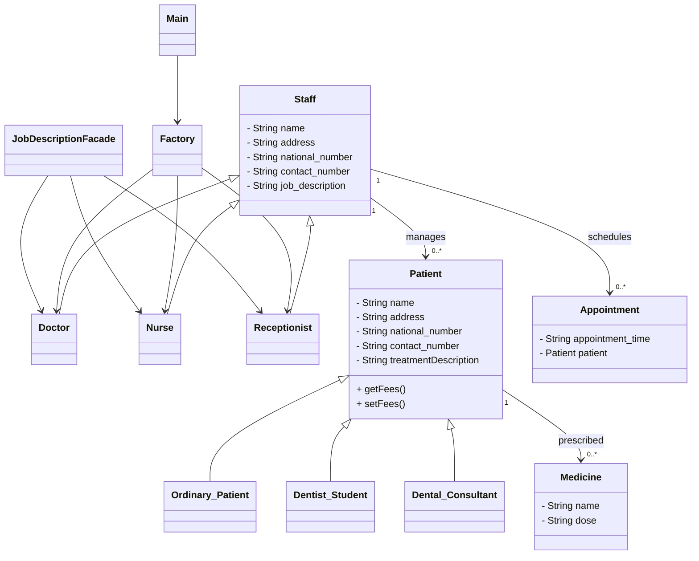

# Dental Clinic Management System (Java OOP Project)

This project is a console-based dental clinic management system implemented in Java. It demonstrates object-oriented programming principles and software design patterns through a structured model of clinic staff, patients, appointments, and administrative operations. The system uses inheritance, polymorphism, the Factory Pattern, and the Facade Pattern to organize all functionality.

## Overview

The system simulates core clinic workflows including patient registration, appointment scheduling, assigning medicines, generating reports, printing bills, and navigating staff roles through a menu-driven interface. The `Main` class launches the system and delegates control to the `Factory` class, which manages all user interactions.

## Key Concepts Demonstrated

### Object-Oriented Programming

* Abstract classes for staff and patient hierarchies
* Inheritance and method overriding
* Polymorphism across role and patient types
* Encapsulation of appointment and medicine data
* Composition through maintained lists of patients, appointments, and medicines

### Design Patterns

* **Factory Pattern** for role-based workflow control
* **Facade Pattern** for simplified access to job description printing

## Project Structure

```
src/
└── dcc/
    ├── Appointment.java
    ├── Dental_Consultant.java
    ├── Dentist_Student.java
    ├── Doctor.java
    ├── Factory.java
    ├── JobDescriptionFacade.java
    ├── Main.java
    ├── Medicine.java
    ├── Nurse.java
    ├── Ordinary_Patient.java
    ├── Patient.java
    ├── Receptionist.java
    ├── Staff.java
    └── Test.java
```

## Class Diagram



## How to Compile and Run

1. Navigate to the source directory:

```
cd src
```

2. Compile all Java files:

```
javac dcc/*.java
```

3. Run the program:

```
java dcc.Main
```

## Summary

This project showcases a complete object-oriented Java application built around realistic clinic workflows. It demonstrates inheritance, polymorphism, class hierarchies, and the use of Factory and Facade patterns to maintain a clean and modular design. The structure serves as a strong example of applying OOP principles to a real-world domain.


